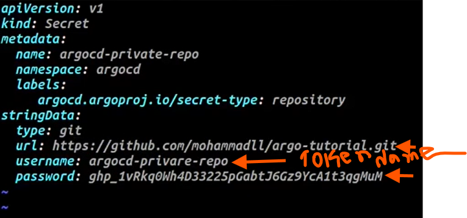
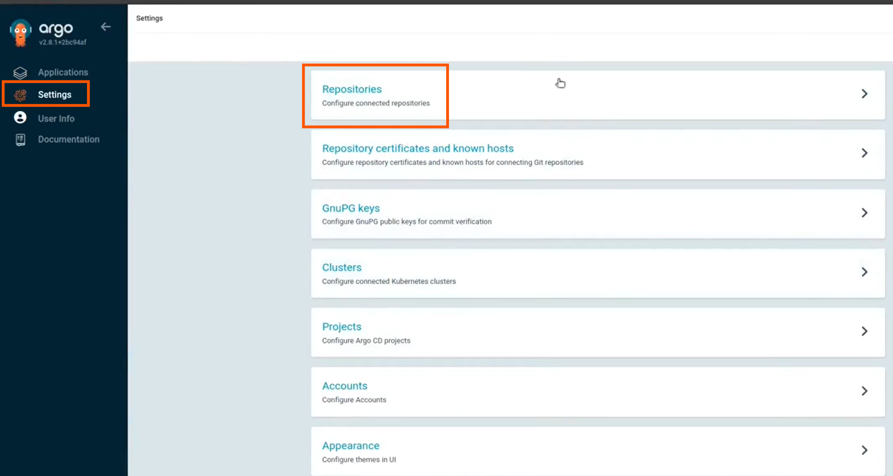
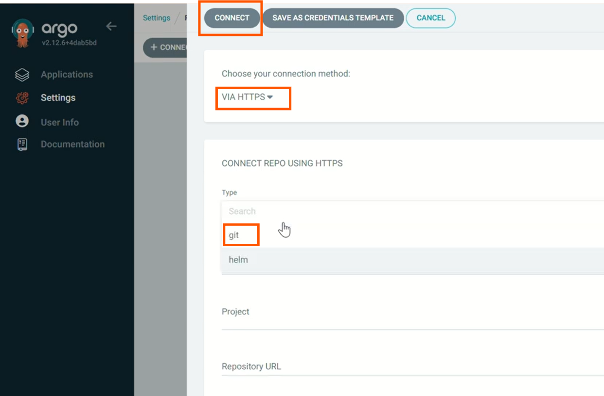
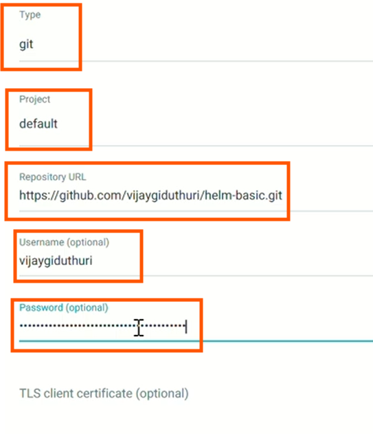

# 🔐 Cloning Private GitHub Repositories in ArgoCD

This guide shows how to configure **ArgoCD** to clone and sync **private GitHub repositories** using a **Personal Access Token (PAT)** via **HTTPS authentication**.

---

## 🛠️ Step-by-Step Setup

### 🔑 1. Generate a GitHub Personal Access Token (PAT)

1. Go to your GitHub account → **Settings → Developer Settings → Personal Access Tokens**.
2. Click **"Generate new token"** (classic or fine-grained).
3. Select required scopes:

   * ✅ `repo` (Full control of private repositories)
4. Click **Generate Token** and **copy it** (you won’t be able to see it again).

---

### 🔐 2. Create a Secret in the ArgoCD Kubernetes Namespace

Use the token to create a Kubernetes Secret that ArgoCD uses to authenticate with GitHub.

#### 🔧 Example: Create Secret Using kubectl

```bash
kubectl create secret generic github-creds-secret \
  --namespace argocd \
  --from-literal=username=your-github-username \
  --from-literal=password=your-personal-access-token \
  --type=kubernetes.io/basic-auth
```

> Replace:
>
> * `your-github-username` with your actual GitHub username
> * `your-personal-access-token` with the token you generated





---

### 🧭 3. Add the Private Repository in ArgoCD UI

1. Open the **ArgoCD UI** → Go to **Settings → Repositories**
2. Click **"Connect Repo using HTTPS"**
3. Fill in the fields:

| Field        | Value                                      |
| ------------ | ------------------------------------------ |
| **Type**     | Git                                        |
| **Name**     | (Any friendly name for your repo)          |
| **Project**  | (Leave as `default` unless custom project) |
| **URL**      | `https://github.com/<user>/<repo>.git`     |
| **Username** | `your-github-username`                     |
| **Password** | `your-personal-access-token`               |

4. Click **"Connect"**

✅ If configured correctly, ArgoCD will validate the repo connection.








---

## 📁 Example Repository URL

```
https://github.com/myuser/private-repo.git
```

* Use the full HTTPS URL.
* Don’t use SSH unless you’ve set up ArgoCD for SSH key authentication (not covered here).

---

## 🚀 Using the Private Repo in an Application

Once added, you can create applications that point to the private repository just like you would with a public one.

In ArgoCD (UI or CLI):

```bash
argocd app create my-private-app \
  --repo https://github.com/myuser/private-repo.git \
  --path path/to/manifests \
  --dest-server https://kubernetes.default.svc \
  --dest-namespace default \
  --sync-policy automated
```

---

## 📚 Additional Notes

* Tokens should be kept **secure**. Avoid hardcoding them in plain files.
* Use [Sealed Secrets](https://github.com/bitnami-labs/sealed-secrets) or a GitOps secret manager (like Vault) for better security in production.
* ArgoCD also supports **SSH-based auth**, but this README focuses on HTTPS + PAT for simplicity.

---

## 🧩 Troubleshooting

| Issue              | Solution                                       |
| ------------------ | ---------------------------------------------- |
| Repo won't connect | Double-check PAT scopes and URL                |
| Sync fails         | Ensure correct repo path and access rights     |
| Secret not found   | Verify namespace and secret name in Kubernetes |

---

