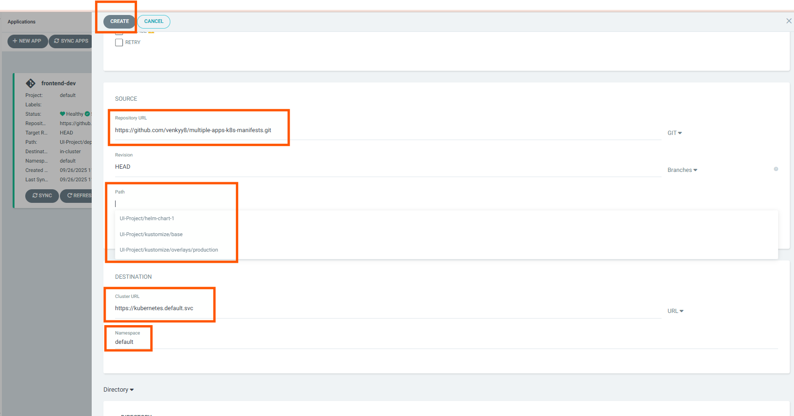
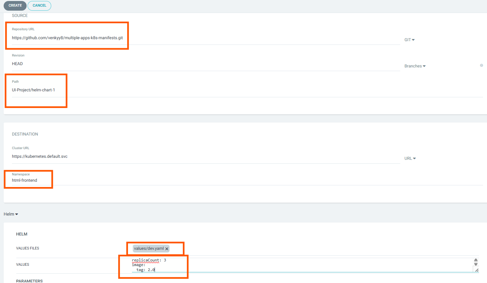

# 🚀 ArgoCD + Helm Chart Deployment Demo

This repository demonstrates deploying applications to Kubernetes using **ArgoCD** and **Helm charts**, with support for custom `values.yaml` files and GitOps practices.

---

## 📦 What's Inside?

* Helm chart(s) for Kubernetes deployment
* Custom `values.yaml` files for different environments (e.g., `dev`, `prod`)
* ArgoCD-compatible structure for GitOps automation



---

## 🛠️ ArgoCD + Helm Setup

ArgoCD supports **Helm chart deployments out of the box**.

When you deploy a Helm chart via ArgoCD:

* By default, ArgoCD uses the `values.yaml` file inside the chart.
* You can override this behavior using a custom values file (e.g., `values/dev.yaml`).

---

## 📁 Directory Structure Example

```
.
├── charts/
│   └── my-app/
│       ├── Chart.yaml
│       ├── templates/
│       └── values.yaml
└── values/
    ├── dev.yaml
    └── prod.yaml
```

---

## 📌 How to Use Custom `values.yaml` in ArgoCD

When creating a new **Helm-based** application in ArgoCD, follow these steps to use a specific `values.yaml` file:

### ➤ 1. Chart Path

If your chart is in the root of the repo:

```
Path: .
```

If the chart is in a subdirectory:

```
Path: charts/my-app
```

### ➤ 2. Specify Custom Values File

In the ArgoCD UI (or via CLI), enter the path to your custom values file in the **"Values Files"** field:

```
values/dev.yaml
```

📌 Make sure the path is **relative to the repository root**.

---

## ⚠️ Values Section in ArgoCD

### 🔹 “Values Files” field:

Use this to load an entire custom values file (e.g., `values/dev.yaml`).

### 🔹 “Values” field:

This is optional and is used for **inline overrides**. Example:

```yaml
replicaCount: 3
image:
  tag: dev
```

✅ You **do not need** to use this section if you're already specifying a full `values.yaml` file under “Values Files”.





---

## ✅ Sync & Deploy

Once the application is created in ArgoCD:

* ArgoCD will render the Helm chart using your chosen `values.yaml` file
* Deployment will begin automatically if **auto-sync** is enabled
* Changes in the `values.yaml` or chart will trigger automatic updates (based on polling interval)

---

## 🔄 Auto-Sync and Rollbacks

* ArgoCD periodically checks the Git repo (default: every 3 minutes)
* You can rollback to any previous release directly from the ArgoCD UI
* Commit SHAs and Helm revision history are tracked

---

## 🔍 Monitoring

In the ArgoCD UI or using the CLI, you can view:

* Sync status (Synced / OutOfSync)
* Deployed chart version and app version
* Custom values in use
* Live manifests after Helm rendering

---

## 🧪 Example ArgoCD CLI Command

```bash
argocd app create helm-app \
  --repo https://github.com/your-user/your-repo.git \
  --path charts/my-app \
  --dest-server https://kubernetes.default.svc \
  --dest-namespace default \
  --helm-values values/dev.yaml \
  --sync-policy automated
```

---

