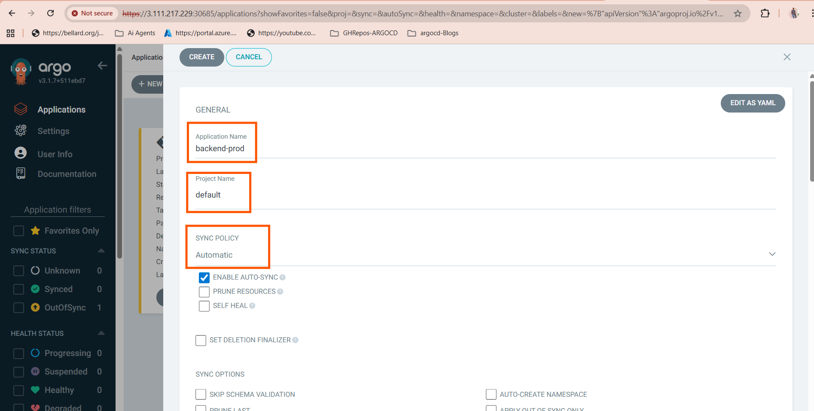
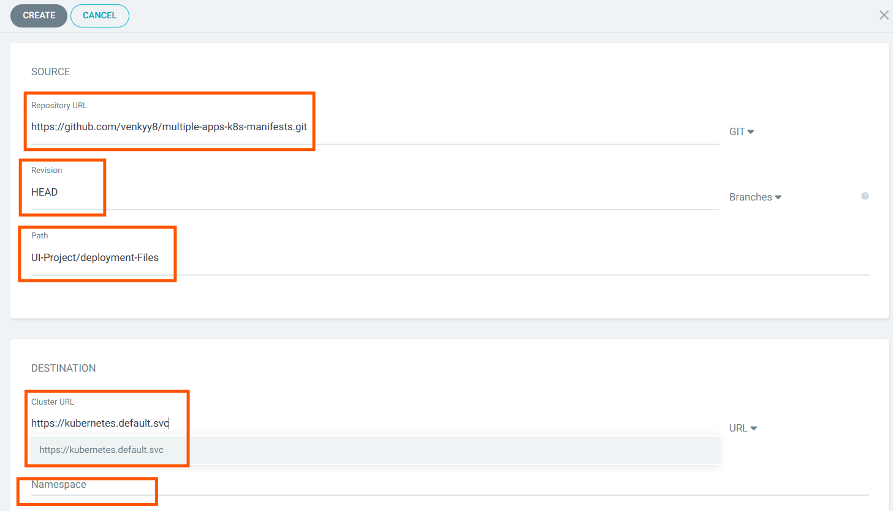
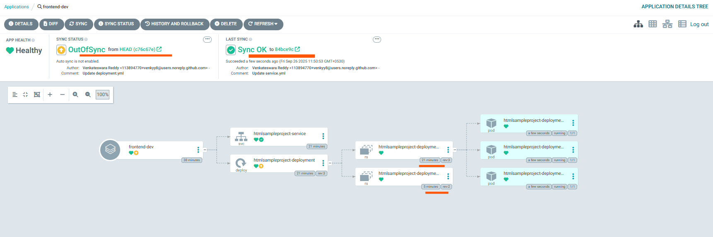
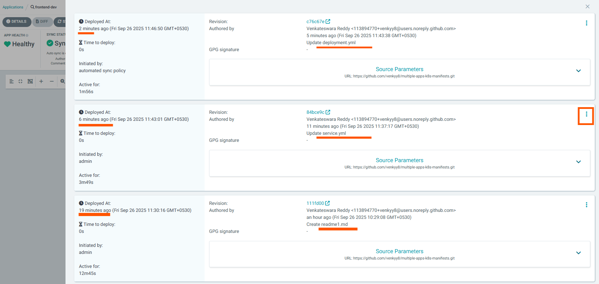
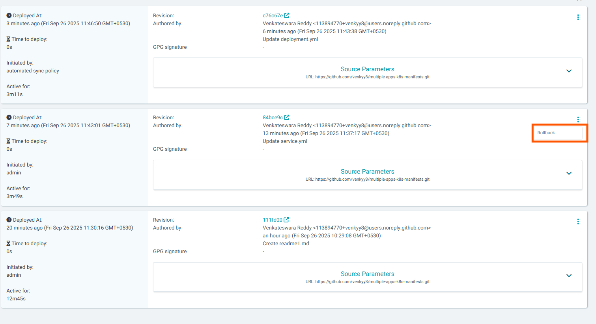
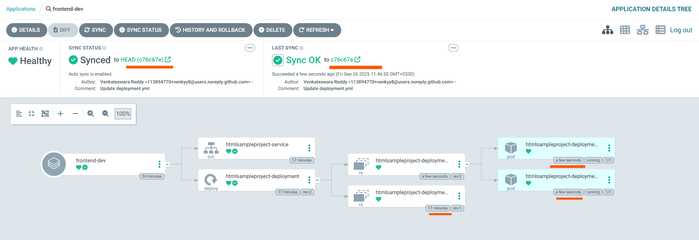
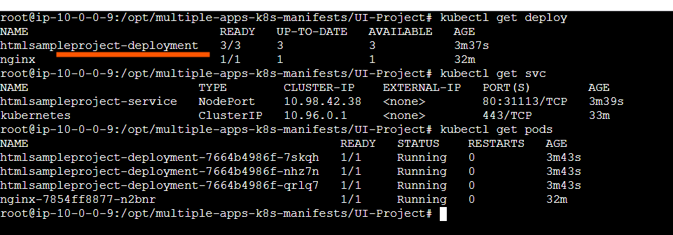
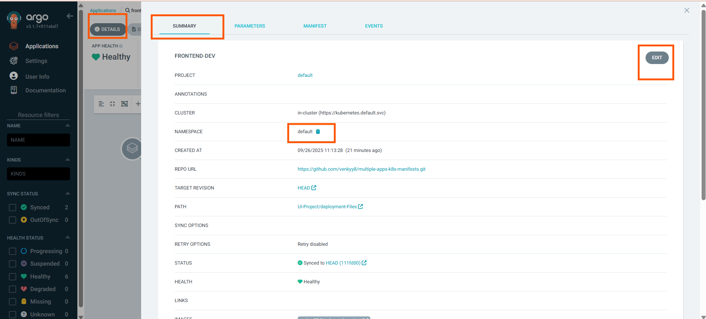

# 🚀 ArgoCD Kubernetes Deployment Demo

This repository contains a sample Kubernetes deployment managed using **ArgoCD**. It demonstrates GitOps principles including automated sync, rollback, and namespace management.

## 📁 Repository Structure

This repo includes Kubernetes manifest files (YAML) for deploying applications using ArgoCD.


---

## 🛠️ Deployment Instructions

### 1. Set the Namespace

In every Kubernetes manifest file (`deployment.yaml`, `service.yaml`, etc.), **you must specify the `namespace` field**:

```yaml
namespace: your-namespace
```

* If deploying to the **default namespace**, explicitly set:

```yaml
namespace: default
```

⚠️ If the namespace is not defined in the manifest, ArgoCD will not know where to deploy, and you'll need to manually set the namespace via the ArgoCD UI (not recommended for GitOps workflows).

---

### 2. Create the Application in ArgoCD

You can create the application via:

* **ArgoCD UI**
* **CLI**:

```bash
argocd app create my-app \
  --repo https://github.com/your-user/your-repo.git \
  --path ./app-path \
  --dest-server https://kubernetes.default.svc \
  --dest-namespace your-namespace \
  --sync-policy automated
```







---

## 🔄 Auto-Sync & Refresh

ArgoCD checks your Git repository for changes **every 3 minutes by default**.

* ✅ If there are changes, **ArgoCD automatically syncs** the application with the cluster.
* You can adjust the **sync interval** if needed.

You’ll be able to see the sync status and commit IDs directly in the ArgoCD UI or in the CLI.




---

## 📜 Deployment History & Rollbacks

ArgoCD tracks every deployment and provides:

* A **detailed deployment history**
* The ability to **rollback** to any previous version with a single click or CLI command:

```bash
argocd app rollback my-app <revision-number>
```

After rollback:

* Deployment will automatically reflect the changes.
* Sync status and commit ID will update accordingly.






---

## 📊 Monitoring Deployment Status

You can view:

* **Live sync status** in ArgoCD UI (Synced / OutOfSync)
* **Commit IDs** for traceability
* **Deployment logs/output** in both UI and terminal using:

```bash
argocd app get my-app
```





---

## ✏️ Editing an Existing Application

If you need to update or edit an existing ArgoCD application (e.g., change sync interval, repo, or path):

1. Use the **ArgoCD UI** or CLI:

```bash
argocd app set my-app --repo <new-repo> --path <new-path> --sync-policy automated
```

2. Alternatively, edit directly in the UI under the application settings.


---

## 📦 Example Output

After a successful deployment, you’ll see:

* Application status as **Synced**
* Commit ID of the deployed revision
* Option to **rollback**, **delete**, or **resync**

---

