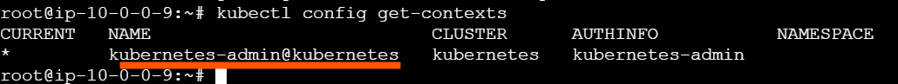
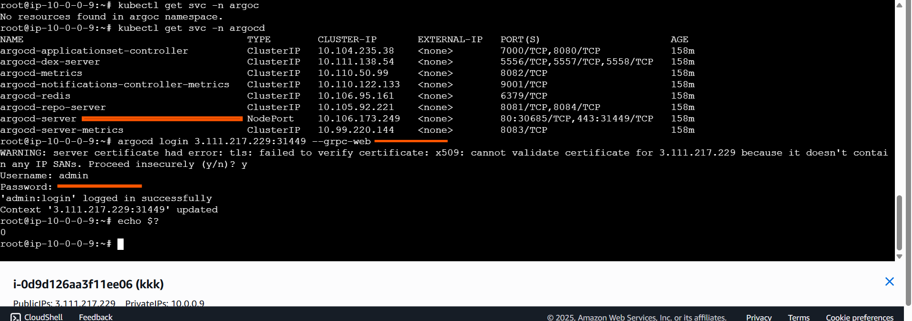
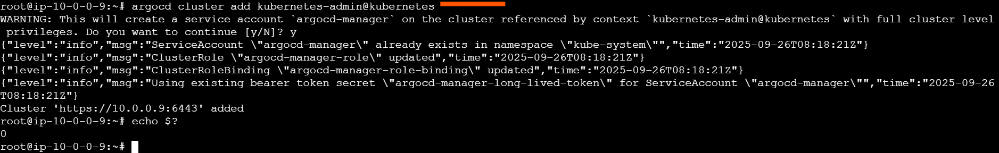
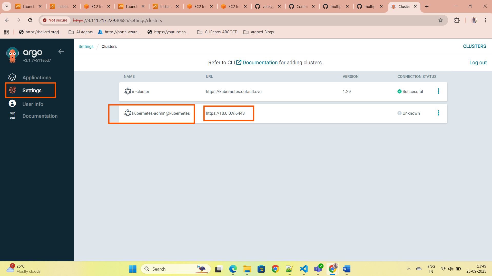

# 🔧 ArgoCD CLI Installation & Multi-Cluster Setup Demo

This README document tells how to:

* Install the **ArgoCD CLI**
* Add a **second Kubernetes cluster** to ArgoCD using the CLI
* Verify the setup via the **ArgoCD UI**

---

## 📥 Step 1: Install the ArgoCD CLI

Run the following commands to download and install the latest version of the ArgoCD CLI:

```bash
# Get the latest version tag
VERSION=$(curl --silent "https://api.github.com/repos/argoproj/argo-cd/releases/latest" | grep -Po '"tag_name": "\K.*?(?=")')

# Download the binary
curl -sSL -o argocd-linux-amd64 "https://github.com/argoproj/argo-cd/releases/download/${VERSION}/argocd-linux-amd64"

# Make it executable
chmod +x argocd-linux-amd64

# Move to /usr/local/bin
sudo mv argocd-linux-amd64 /usr/local/bin/argocd
```

### ✅ Verify the Installation:

```bash
argocd version
```

---

## 🔗 Step 2: Connect a Second Kubernetes Cluster to ArgoCD

### 📁 1. Get the Admin Config of Second Cluster

From your **second Kubernetes cluster**, copy the Kubernetes admin configuration file:

```bash
# On 2nd cluster
cat /etc/kubernetes/admin.conf
```

Copy the contents and **save it in the HUB (ArgoCD) cluster** under:

```bash
~/admin-2nd-cluster.conf
```

---

### 📋 2. Get the Available Contexts

Run the following to see available contexts:

```bash
kubectl config get-contexts --kubeconfig ~/admin-2nd-cluster.conf
```

📌 **Note down the context name** of the second cluster (e.g., `kubernetes-admin@kubernetes`).



---

### ➕ 3. Add the Second Cluster to ArgoCD

Before adding the cluster, make sure you're **logged into ArgoCD** using the CLI:

```bash
# Login to ArgoCD
argocd login <ARGOCD-SERVER-IP>:<PORT>
```

Then add the second cluster:

```bash
argocd cluster add kubernetes-admin@kubernetes --kubeconfig ~/admin-2nd-cluster.conf
```

> ⚠️ If you get an error here, it’s usually because you haven’t logged into the correct ArgoCD server. Use the correct `argocd login` command with your server IP.






---

## 🧭 Step 3: Verify in ArgoCD UI

1. Open the ArgoCD UI.
2. Go to **Settings → Clusters**.
3. You will now see:

   * The name of the second cluster
   * Its IP address and other details




---

## 🚀 Step 4: Create an Application Using the New Cluster

When you create a new application in ArgoCD:

* Under the **Destination** section, select the **newly added cluster**.
* You can now deploy applications to that cluster directly from ArgoCD.


---

## 📝 Notes

* You can add multiple clusters using the same method with different kubeconfig files.
* Use `argocd cluster list` to view all clusters registered with ArgoCD via CLI.
* Ensure network connectivity between the ArgoCD pod and the second cluster API server.

---
