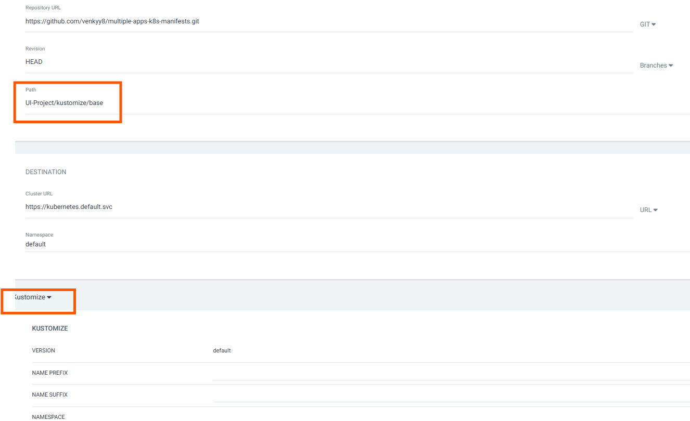
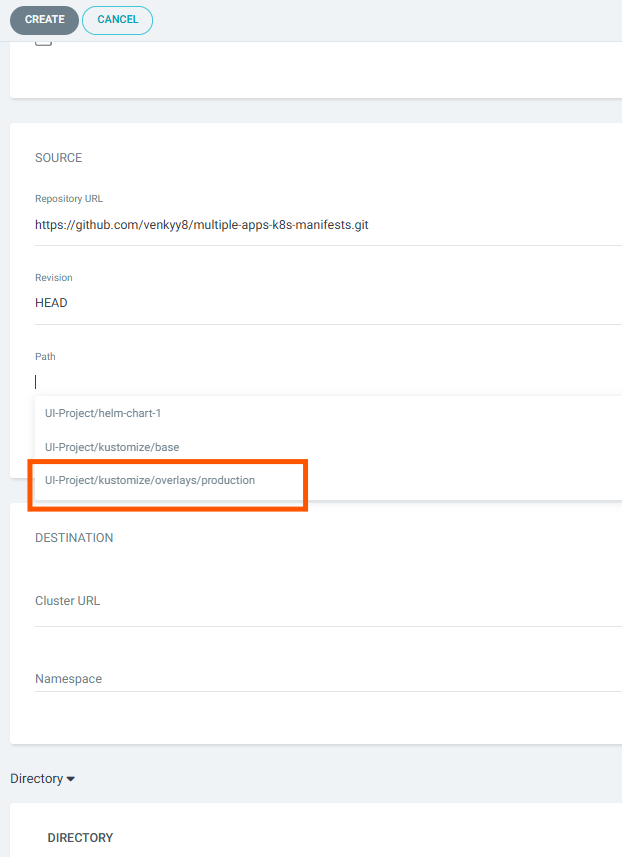

# 🚀 ArgoCD + Kustomize Deployment Demo

This repository demonstrates how to use **ArgoCD** with **Kustomize** to manage Kubernetes deployments across environments (e.g., dev, staging, production) using GitOps best practices.

---

## 📁 Directory Structure

```
kustomize/
├── base/
│   ├── deployment.yaml
│   ├── service.yaml
│   └── kustomization.yaml
└── overlays/
    └── production/
        ├── deployment-patch.yaml
        ├── service-patch.yaml
        └── kustomization.yaml
```

* **`base/`**: Contains the common configuration shared across all environments.
* **`overlays/production/`**: Contains environment-specific overrides using patches and metadata changes.

---

## 🧭 Deploying with ArgoCD

### 🔹 Set the Correct Path

When creating the ArgoCD application, you **must set the path to**:

```
kustomize/overlays/production
```

> ✅ ArgoCD will **automatically detect** this as a **Kustomize** application if it finds a `kustomization.yaml` file in the specified path.





### 📌 Example ArgoCD CLI Command

```bash
argocd app create kustomize-app \
  --repo https://github.com/your-user/your-repo.git \
  --path kustomize/overlays/production \
  --dest-server https://kubernetes.default.svc \
  --dest-namespace default \
  --sync-policy automated
```

---

## ⚙️ How Kustomize Works Here

The `kustomization.yaml` inside the `overlays/production/` folder looks like this:

```yaml
resources:
  - ../../base

namePrefix: prod-

patches:
  - path: deployment-patch.yaml
    target:
      kind: Deployment
      name: htmlsampleproject-deployment
  - path: service-patch.yaml
    target:
      kind: Service
      name: htmlsampleproject-service
```

### 🔍 What This Does:

* **`resources:`** pulls in the base configurations (`deployment.yaml`, `service.yaml`)
* **`namePrefix:`** prepends `prod-` to all resource names (e.g., `prod-htmlsampleproject-deployment`)
* **`patches:`** apply changes to base manifests specifically for the production environment:

  * Updates containers, image tags, replicas, etc. in the `deployment`
  * Changes ports, selectors, or metadata in the `service`

---

## 🔄 Sync and Updates

* ArgoCD polls the Git repo (default: every 3 minutes) to detect changes.
* If anything in the overlay (or base) is changed and pushed, ArgoCD will **auto-sync** (if configured).
* You can manually trigger a sync via UI or CLI.

---

## 🔁 Rollbacks

Since ArgoCD tracks Git history and application revisions, rolling back is easy:

```bash
argocd app rollback kustomize-app <revision-number>
```

This reverts the app to a previously synced Git commit.

---

